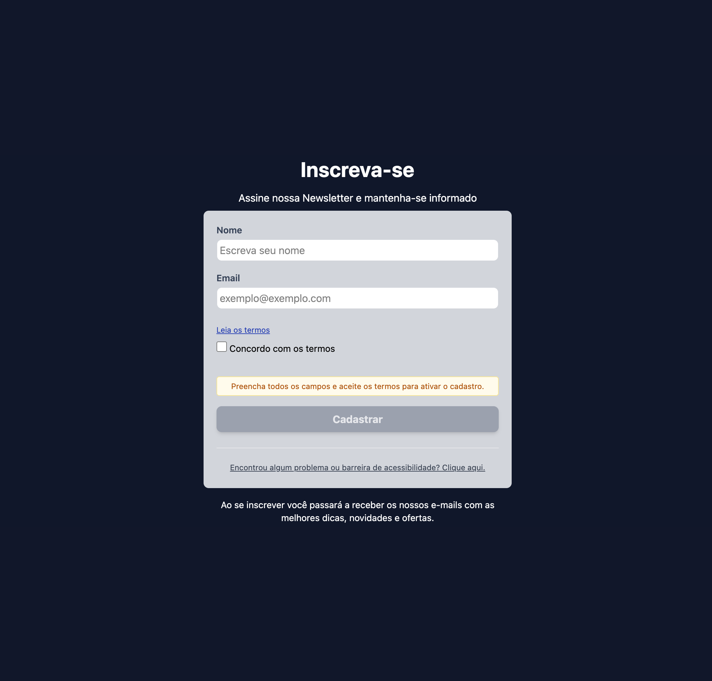

# 📧 Modern Newsletter Subscription Form

A professional, highly accessible, and strictly tested newsletter subscription form built with **React**, **TypeScript**, and **Tailwind CSS**.

[](https://github.com/rebecafloriano/form-newsletter/actions/workflows/main.yml)




> 🚀 **Live Demo:** > https://rebecafloriano.github.io/form-newsletter/

---

## ✨ Key Features

- **Production-Ready Architecture** Separation of concerns between UI atomic elements, business logic layer (`validate.ts`), and strict TypeScript typing.
- **Robust Automated Testing Suite** 20 comprehensive unit and integration tests tracking DOM rendering, asynchronous state shifts (loading, success, error), and edge-case form logic.
- **Strict Linting & Code Formatting** Zero-warning code baseline enforced locally and on remote environments via ESLint and Prettier formatting pipelines.
- **Strict Accessibility Compliance (WCAG 2.1 AA)** Audited with `axe DevTools` ensuring a flawless **0 issues** score, utilizing semantic layout landmarks (`<form>`, labels), strict color contrast thresholds (minimum 4.5:1 ratio), and explicit screen-reader feedback loops.
- **API Integration & Validation Trimming** Full input string trimming defense to filter out malicious whitespace inputs before safe payload delivery via Web3Forms.
- **User Feedback Loop for Continuous Improvement:** Features a dedicated, dynamic accessibility and bug-reporting form in the footer, creating a direct communication channel for users to report technical barriers or usability issues.

---

## 🛠️ Tech Stack

- **React 19**
- **TypeScript** (Strict Mode)
- **Tailwind CSS**
- **Vite**
- **Vitest** & **React Testing Library** (Test Environment)
- **Playwright** (End-to-End Multi-browser testing)
- **ESLint** & **Prettier** (Code Quality)

---

## 🚀 How to Run & Validate the Project

Follow these steps to spin up the environment and run the full engineering pipeline locally:

### 1. Setup and Installation
  ```bash
    # Clone the repository
    git clone [https://github.com/rebecafloriano/form-newsletter.git](https://github.com/rebecafloriano/form-newsletter.git)

    # Navigate to the project folder
    cd form-newsletter

    # Perform a clean dependency installation
    npm install

    # Install Playwright browsers (needed for E2E tests)
    npx playwright install
```

### 2. Development & Build Scripts
  ```bash
# Start the local development server (Vite)
npm run dev

# Compile TypeScript and build for production
npm run build    
  ```

### 3. Quality Assurance Pipeline (Local Validation)
```bash
# 🧪 Run the full automated testing suite (20 tests)
npm run test

# 🎨 Automatically format all code files via Prettier
npm run format

# 🔍 Run static analysis to catch syntax warnings, type safety, and bugs
npm run lint    
  ```
## 🧪 Automated Testing Strategy

This project combines two different testing methodologies to ensure absolute resilience:

### A. Unit & Integration Testing (Vitest & React Testing Library)
The **20-test suite** extensively covers:
* **Full User Journey Integration:** Complete customer journey simulating full form submission, success screen transitions, and immediate accessibility feedback loops.
* **API Boundary Testing:** Network errors (`Network Error`) and successful handshakes handled safely via isolated `vi.spyOn` and `beforeEach` lifecycles.
* **DOM Leaks Prevention:** Strict usage of `queryBy*` query selectors ensuring precise element removal from the screen without false positives.

### B. End-to-End (E2E) Testing (Playwright)
A **15-test suite** running concurrently across the three major browser engines: **Chromium** (Chrome/Edge), **Firefox**, and **WebKit** (Safari).
* **Multi-Browser Consistency:** Verifies UX responsiveness and interaction performance across different platforms.
* **HTML5 Validation:** Asserts the browser's native behavior (`checkValidity`) for malformed emails.
* **Advanced Network Mocking:** Intercepts outgoing requests to `api.web3forms.com` to test simulated Server Errors (Status 500) and mock success handshakes without consuming actual API submission credits.
* **Interactive UI Flows:** Tests the dynamic accessibility footer form, guaranteeing that state toggles, textarea inputs, and cancellation actions function correctly.

To run the E2E suite:
```bash
# Ensure your local server is running (npm run dev) before triggering E2E tests
npm run dev

# Run all 15 tests in headless mode (background)
npx playwright test

# Launch Playwright UI mode for interactive debugging and visual inspection
npx playwright test --ui

# Open the comprehensive HTML test report
npx playwright show-report
```

## 🤖 Continuous Integration (CI/CD)
This repository enforces a strict GitHub Actions Pipeline (`main.yml`) on every push and pull request to the `main` branch. The automated workflow guarantees the stability of the live application by executing:

Fresh workspace dependency setup (`npm ci`).

Code style checks (`Prettier`).

Static code validation (`ESLint` code quality check with 0 warnings allowance).

Full testing suite execution (`Vitest`).

Production build compilation and deployment to GitHub Pages.

## 📂 Project Structure
```Plaintext
src/
├── assets/          # Static layout assets and screenshots
├── components/      
│   ├── ui/          # Atomic reusable UI components (Input, Button, Checkbox)
│   └── Form.tsx     # Main Form container integration component
├── types/           # Core TypeScript data structures and models
├── utils/           # Pure, decoupled business rules and validations
├── App.tsx          # Application root view wrapper
└── setupTests.ts    # Extended Jest-DOM matching extensions for Vitest
tests/               # Playwright End-to-End (E2E) test specifications
